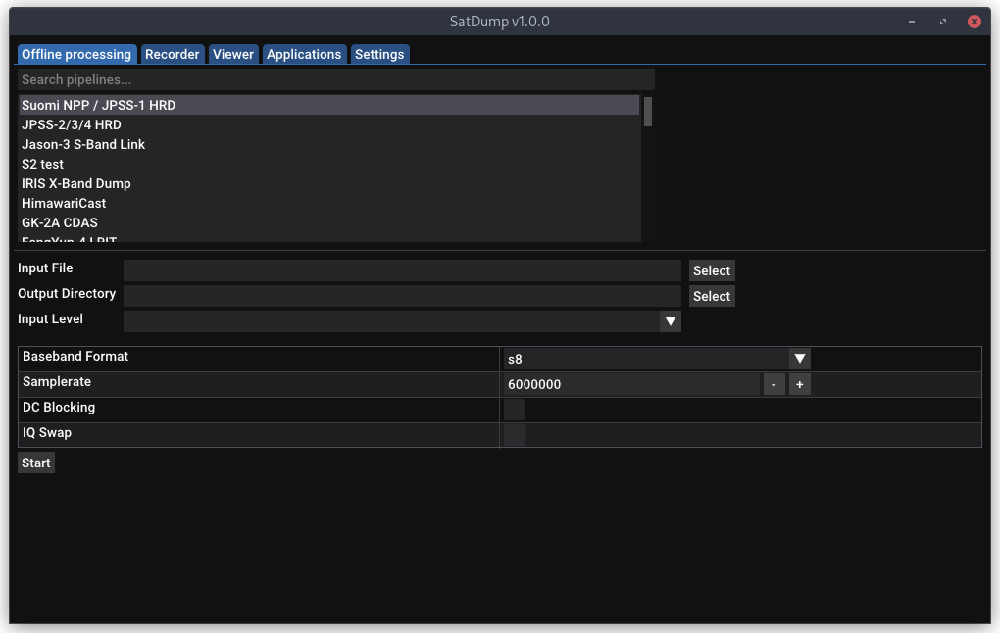
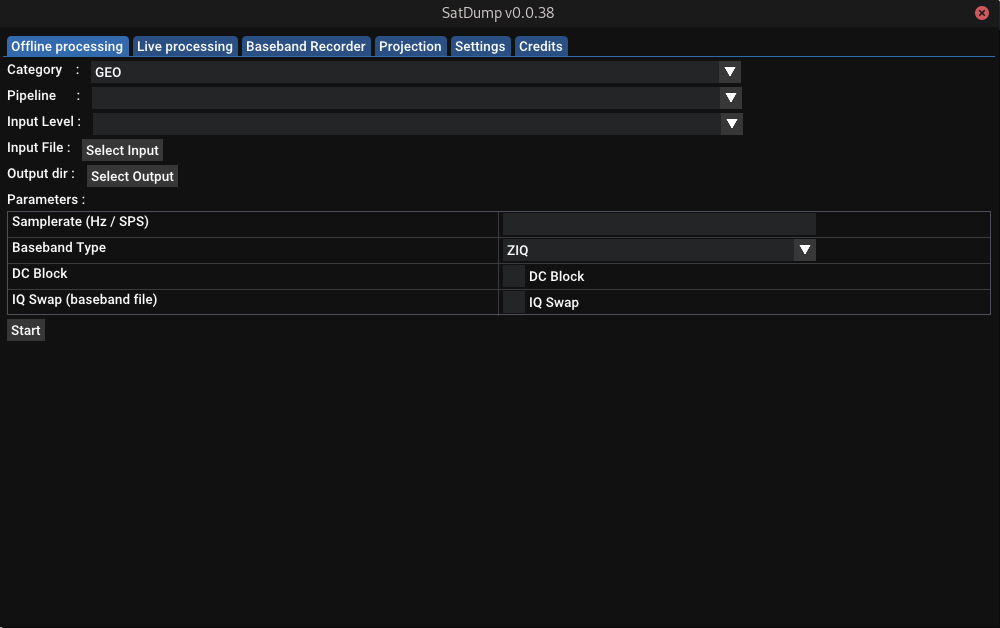
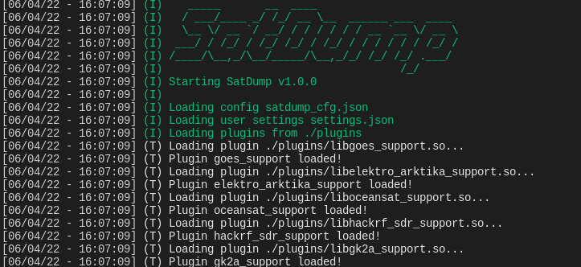

# SatDump


A generic satellite data processing software.
*Thanks Crosswalkersam for the icon!*

There now also is a [Matrix](https://matrix.to/#/#satdump:altillimity.com) room if you want to chat!

# Introduction

*Note : This is a very basic "how-to" skipping details and assuming some knowledge of what you are doing. For more details and advanced use cases, please see the [detailed documentation](https://docs.satdump.org).* 

## GUI Version

### Offline processing (recorded data)
Quick-Start :
- Choose the appropriate pipeline for what you want to process
- Select the input file (baseband, frames, soft symbols...)
- Set the appropriate input level (what your file is)
- Check settings shown below are right (such as samplerate)
- Press "Start"!




*SatDump demodulating a DVB-S2 Baseband*

### Live processing or recording (directly from your SDR)

Quick-Start :
- Go in the "Recorder" Tab
- Select and start your SDR Device
- Choose a pipeline
- Start it, and done!
- For recording, use the recording tab instead. Both processing and recording can be used at once.


## CLI Version



### Offline processing

```
Usage : satdump [pipeline_id] [input_level] [input_file] [output_file_or_directory] [additional options as required]
Extra options (examples. Any parameter used in modules can be used here) :
  --samplerate [baseband_samplerate] --baseband_format [cf32/cs32/cs16/cs8/cu8] --dc_block --iq_swap
Sample command :
satdump metop_ahrpt baseband /home/user/metop_baseband.cs16 metop_output_directory --samplerate 6e6 --baseband_format cs16
```

You can find a list of Satellite pipelines and their parameters [Here](https://docs.satdump.org/pipelines.html).

### Live processing

```
Usage : satdump live [pipeline_id] [output_file_or_directory] [additional options as required]
Extra options (examples. Any parameter used in modules or sources can be used here) :
  --samplerate [baseband_samplerate] --baseband_format [cf32/cs32/cs16/cs8/w8] --dc_block --iq_swap
  --source [airspy/rtlsdr/etc] --gain 20 --bias
As well as --timeout in seconds
Sample command :
satdump live metop_ahrpt metop_output_directory --source airspy --samplerate 6e6 --frequency 1701.3e6 --general_gain 18 --bias --timeout 780
```

You can find a list of all SDR Options [Here](https://docs.satdump.org/sdr_options.html). Run `satdump sdr_probe` to get a list of available SDRs and their IDs.

### Recording

```
Usage : satdump record [output_baseband (without extension!)] [additional options as required]
Extra options (examples. Any parameter used in sources can be used here) :
  --samplerate [baseband_samplerate] --baseband_format [cf32/cs32/cs16/cs8/cu8/w16] --dc_block --iq_swap
  --source [airspy/rtlsdr/etc] --gain 20 --bias
As well as --timeout in seconds
Sample command :
satdump record baseband_name --source airspy --samplerate 6e6 --frequency 1701.3e6 --general_gain 18 --bias --timeout 780 --baseband_format cf32
```

# Building / Installing

### Windows
The fastest way to get started is to head over to the [Releases](https://github.com/altillimity/SatDump/releases) page, where you can download SatDump's installer or portable app - no compilation necessary.

Our builds are made with Visual Studio 2019 for x64, so the appropriate Visual C++ Runtime will be required (though, likely to be already installed). You can get it [here](https://support.microsoft.com/en-us/topic/the-latest-supported-visual-c-downloads-2647da03-1eea-4433-9aff-95f26a218cc0).   Once downloaded, run either satdump-ui.exe or satdump.exe (CLI) to get started!

For compilation information, see the dedicated documentation [here](https://docs.satdump.org/build_windows.html). *Note : Mingw builds are NOT supported, VOLK will not work.*

### macOS
Dependency-free macOS builds are provided on the [releases page](https://github.com/altillimity/SatDump/releases) (Thanks to JVital2013, the builds are also signed!).

General build instructions (Brew and XCode command line tools required)

```bash
# Install build tools
brew install cmake dylibbundler pkg-config libtool autoconf automake meson

# Clone SatDump
git clone https://github.com/SatDump/SatDump.git && cd SatDump

# Build dependencies
./macOS/Configure-vcpkg.sh

# Finally, build.
# If you do not want to build the GUI Version, add -DBUILD_GUI=OFF to the command
# If you want to disable some SDRs, you can add -DPLUGIN_HACKRF_SDR_SUPPORT=OFF or similar
mkdir build && cd build
cmake -DCMAKE_TOOLCHAIN_FILE=../vcpkg/scripts/buildsystems/vcpkg.cmake -DCMAKE_BUILD_TYPE=Release -DVCPKG_TARGET_TRIPLET=osx-satdump ..
make -j$(sysctl -n hw.logicalcpu)

# To run without bundling
ln -s ../pipelines .        # Symlink pipelines so it can run
ln -s ../resources .        # Symlink resources so it can run
ln -s ../satdump_cfg.json . # Symlink settings so it can run
./satdump-ui

# Make an app bundle (to add to your /Applications folder). Saves to build/MacApp, and
# a .dmg is created as well. 'make install' is not supported.
../macOS/bundle.sh
```

### Linux

On Linux, building from source is recommended, but builds are provided for x64-based Ubuntu distributions. Here are some build instructions for common distros.

---

<details>

<summary>Install Dependencies - Debian, Ubuntu, and other Debian-based distros</summary>

```bash
sudo apt install git build-essential cmake g++ pkgconf libfftw3-dev libpng-dev \
                 libtiff-dev libjemalloc-dev libcurl4-openssl-dev
sudo apt install libvolk-dev                                                      # If this package is not found, use libvolk2-dev or libvolk1-dev
sudo apt install libnng-dev                                                       # If this package is not found, follow build instructions below for NNG

# (Optional)
sudo apt install libglfw3-dev zenity                                              # Only if you want to build the GUI Version
sudo apt install portaudio19-dev                                                  # Only if you want audio output
sudo apt install libzstd-dev                                                      # Only if you want to build with ZIQ Recording compression
sudo apt install libhdf5-dev                                                      # Only if you want official product support (ex, EUMETSAT)
sudo apt install librtlsdr-dev libhackrf-dev libairspy-dev libairspyhf-dev        # All libraries required for live processing
sudo apt install libad9361-dev libiio-dev                                         # For ADALM-Pluto, PlutoPlus, AntSDR and other SDRs based on Analog AD9361
sudo apt install libbladerf-dev                                                   # For BladeRF
sudo apt install libomp-dev                                                       # Shouldn't be required in general, but in case you have errors with OMP
sudo apt install ocl-icd-opencl-dev                                               # Optional, but recommended as it drastically increases speed of some operations. Installs OpenCL.
sudo apt install intel-opencl-icd                                                 # Enables OpenCL for Intel Integrated Graphics
sudo apt install mesa-opencl-icd                                                  # For AMD Radeon cards *BEFORE series 5000* (e.g. RX480/580...). For newer cards, please install the official AMD drivers.

# One-liner to install all dependencies:
sudo apt install git build-essential cmake g++ pkgconf libfftw3-dev libpng-dev \
                 libtiff-dev libjemalloc-dev libcurl4-openssl-dev libvolk-dev libnng-dev \
                 libglfw3-dev zenity portaudio19-dev libzstd-dev libhdf5-dev librtlsdr-dev \
                 libhackrf-dev libairspy-dev libairspyhf-dev libad9361-dev libiio-dev \
                 libbladerf-dev libomp-dev ocl-icd-opencl-dev intel-opencl-icd mesa-opencl-icd
```

</details>
<details>

<summary>Install Dependencies - Red-Hat-based systems</summary>

```bash
sudo dnf install git cmake g++ fftw-devel volk-devel libpng-devel jemalloc-devel \
                 libtiff-devel nng-devel curl-devel

# (Optional)
sudo dnf install glfw-devel zenity                                                # Only if you want to build the GUI Version
sudo dnf install portaudio-devel                                                  # Only if you want audio output
sudo dnf install libzstd-devel                                                    # Only if you want to build with ZIQ Recording compression
sudo dnf install hdf5-devel                                                       # Only if you want official product support (ex, EUMETSAT)
sudo dnf install rtl-sdr-devel hackrf-devel airspyone_host-devel                  # All libraries required for live processing
sudo dnf install libomp-devel                                                     # Shouldn't be required in general, but in case you have errors with OMP
sudo dnf install ocl-icd                                                          # Optional, but recommended as it drastically increases speed of some operations. Installs OpenCL.
sudo dnf install intel-opencl                                                     # Enables OpenCL for Intel Integrated Graphics

# One-liner to install all dependencies:
sudo dnf install git cmake g++ fftw-devel volk-devel libpng-devel jemalloc-devel hdf5-devel \
                 libtiff-devel nng-devel curl-devel glfw-devel zenity portaudio-devel \
                 libzstd-devel rtl-sdr-devel hackrf-devel airspyone_host-devel libomp-devel \
                 ocl-icd intel-opencl
```
</details>
<details>

<summary>Install Dependencies - Alpine-based systems</summary>

```bash
# Adding the testing repository is required for libvolk-dev.
# You need to build libnng from source, see below.
sudo apk add git cmake make g++ pkgconf fftw-dev libvolk-dev libpng-dev \
             jemalloc-dev tiff-dev curl-dev

# (Optional)
sudo apk add glfw-dev zenity                                           # Only if you want to build the GUI Version
sudo apk add portaudio-dev                                             # Only if you want audio output
sudo apk add zstd-dev                                                  # Only if you want to build with ZIQ Recording compression
sudo apk add hdf5-dev                                                  # Only if you want official product support (ex, EUMETSAT)
sudo apk add librtlsdr-dev hackrf-dev airspyone-host-dev airspyhf-dev  # All libraries required for live processing
sudo apk add opencl-dev                                                # Optional, but recommended as it drastically increases speed of some operations. Installs OpenCL. Community repo required.
```
</details>
<details>

<summary>Install Dependencies - Gentoo</summary>

```bash
# Assumes you already have gcc, g++, pkgconf, and cmake installed. 
# Using Gentoo, you probably do!
#
# NOTE: You will need to build nng yourself. See below for details.
#       Some SDR sources, such as AirSpy, also need to be build from
#       source if needed.

sudo emerge --ask dev-vcs/git sci-libs/fftw dev-libs/jemalloc sci-libs/volk \
                  media-libs/libpng media-libs/tiff net-misc/curl

sudo emerge --ask media-libs/glfw gnome-extra/zenity      # Only if you want to build the GUI Version
sudo emerge --ask media-libs/portaudio                    # Only if you want audio output
sudo emerge --ask app-arch/zstd                           # Only if you want to build with ZIQ Recording compression
sudo emerge --ask sci-libs/hdf5                           # Only if you want official product support (ex, EUMETSAT)
sudo emerge --ask net-wireless/rtl-sdr                    # RTL-SDR Support
sudo emerge --ask net-libs/libhackrf                      # HackRF Support
sudo emerge --ask net-wireless/bladerf                    # bladeRF Support
sudo emerge --ask net-libs/libiio net-libs/libad9361-iio  # For ADALM-Pluto, PlutoPlus, AntSDR and other SDRs based on Analog AD9361
sudo emerge --ask dev-libs/opencl-icd-loader              # OpenCL Support, Optional, but recommended

# One-liner to install all dependencies:
sudo emerge --ask dev-vcs/git sci-libs/fftw dev-libs/jemalloc sci-libs/volk \
                  media-libs/libpng media-libs/tiff net-misc/curl sci-libs/hdf5 \
                  media-libs/glfw gnome-extra/zenity media-libs/portaudio \
                  app-arch/zstd net-wireless/rtl-sdr net-libs/libhackrf   \
                  net-wireless/bladerf net-libs/libiio net-libs/libad9361-iio \
                  dev-libs/opencl-icd-loader
```

</details>
<details>

<summary>Install Dependencies - openSUSE</summary>

```bash
sudo zypper install git gcc-c++ cmake g++ pkgconf fftw3-devel libpng-devel \
                    libtiff-devel jemalloc-devel libcurl-devel volk-devel  \
                    nng-devel 

# (Optional)
sudo zypper install libglfw-devel zenity                                        # Only if you want to build the GUI Version
sudo zypper install portaudio-devel                                             # Only if you want audio output
sudo zypper install libzstd-devel                                               # Only if you want to build with ZIQ Recording compression
sudo zypper install hdf5-devel                                                  # Only if you want official product support (ex, EUMETSAT)
sudo zypper install rtl-sdr-devel hackrf-devel airspy-devel airspyhf-devel      # All libraries required for live processing
sudo zypper install libad9361-iio-devel libiio-devel                            # For ADALM-Pluto, PlutoPlus, AntSDR and other SDRs based on Analog AD9361
sudo zypper install bladeRF-devel                                               # For BladeRF
sudo zypper install libomp-devel                                                # Shouldn't be required in general, but in case you have errors with OMP
sudo zypper install opencl-headers libOpenCL1                                   # Optional, but recommended as it drastically increases speed of some operations. Installs OpenCL.
sudo zypper install intel-opencl                                                # Enables OpenCL for Intel Integrated Graphics
sudo zypper install Mesa-libOpenCL                                              # For AMD Radeon cards *BEFORE series 5000* (e.g. RX480/580...). For newer cards, please install the official AMD drivers.

# One-liner to install all dependencies:
sudo zypper install git gcc-c++ cmake g++ pkgconf fftw3-devel libpng-devel libtiff-devel jemalloc-devel \
                    libcurl-devel hdf5-devel volk-devel nng-devel libglfw-devel zenity portaudio-devel \
                    libzstd-devel rtl-sdr-devel hackrf-devel airspy-devel airspyhf-devel libad9361-iio-devel \
                    libiio-devel bladeRF-devel libomp-devel opencl-headers libOpenCL1 intel-opencl Mesa-libOpenCL

```

</details>

---

If nng is not available for your distro, you will have to build it from source
```bash
git clone https://github.com/nanomsg/nng.git
cd nng
mkdir build && cd build
cmake -DCMAKE_BUILD_TYPE=Release -DBUILD_SHARED_LIBS=ON -DCMAKE_INSTALL_PREFIX=/usr ..
make -j4
sudo make install
cd ../..
rm -rf nng
```

#### Build SatDump
```
git clone https://github.com/SatDump/SatDump.git
cd SatDump
mkdir build && cd build
# If you do not want to build the GUI Version, add -DBUILD_GUI=OFF to the command
# If you want to disable some SDRs, you can add -DPLUGIN_HACKRF_SDR_SUPPORT=OFF or similar
cmake -DCMAKE_BUILD_TYPE=Release -DCMAKE_INSTALL_PREFIX=/usr ..
make -j`nproc`

# To run without installing
ln -s ../pipelines .        # Symlink pipelines so it can run
ln -s ../resources .        # Symlink resources so it can run
ln -s ../satdump_cfg.json . # Symlink settings so it can run

# To install system-wide
sudo make install

# Run (if you want!)
./satdump-ui
```

### Raspberry Pi

In case you are using RPi3 (any revision) and older. Run ```make -j1 ``` instead of ```make -j`nproc` ``` otherwise the system will crash.
  
### Android

On Android, the preferred source is F-Droid.

[](https://f-droid.org/packages/org.satdump.SatDump)


If this is not an option for you, APKs are also available on the [Release](https://github.com/altillimity/SatDump/releases) page.

Do keep in mind that while pretty much all features perfectly function on Android, there may be some limitations (either due to the hardware) in some places. For example, not all SDR Devices can be used.
Supported SDR devices are :
- RTL-SDR
- Airspy
- AirspyHF
- LimeSDR Mini
- HackRF


### Docker

Building and running under docker is a nice way to separate the build environment and libraries from the host OS.
The build process is a multistage build that uses two images, one with the -dev packages and another for the runtime.
This means that the runtime image can be kept smaller, although the disk space is still needed to complete the build.

To match the system user for the shared files get the same owner, set these in `.env` before building the image.
The user inside the container will always be named `satdump`, but the uid and gid will match the system user.

```bash
# set the current uid and gid 
printf "HOST_UID: $(id -u)\nHOST_GID: $(id -g)\n" > .env

# create the shared directory
mkdir -p srv

# Build the images with compose, 8 parallel
docker compose build --build-arg CMAKE_BUILD_PARALLEL_LEVEL=8

# Launch a shell inside the container/service
docker compose run --rm -it satdump
```

The command that is started inside the container can either be specified at the end on the commandline mentioned above, 
or put in the `.env` with for example `COMMAND: satdump_sdr_server`. If you want to run the sdr server in the background
and have it start automatically on boot, simply launch the container with `docker compose up -d` and check the logs with
`docker compose logs -f`

#### X11 under docker

To use the `satdump-ui` under docker you need to make a few changes.
It is possible to run this on WSL2 as well, change the source to `/run/desktop/mnt/host/wslg/.X11-unix` instead.
In the [docker-compose.yml](docker-compose.yml) you need to uncomment a few lines and make it looks like this:
```yaml
      - type: 'bind'
        source: '/tmp/.X11-unix'
        target: '/tmp/.X11-unix'
```

If the user in the container is not authorized for X11, you will probably get this error message:
`Authorization required, ...`
This is due to the ACL controlling access to your screen.
There's several ways to solve this, a few very broad and insecure, but the following should be acceptable on a non-shared system.

On the host, run: `xhost +local:docker` , then to start the ui: `docker compose run --rm -it satdump satdump-ui`
